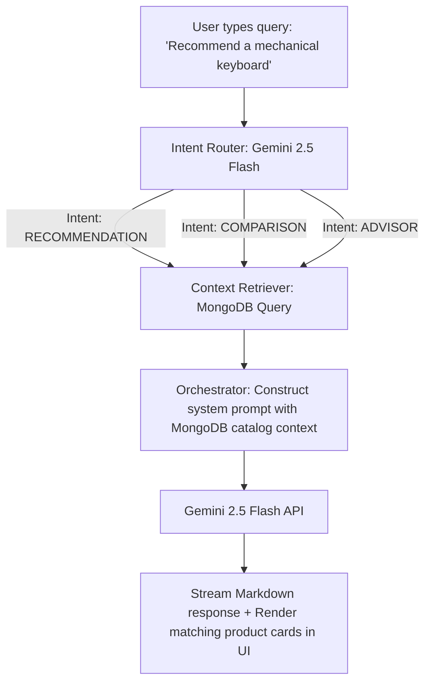

# Zevora | Premium E-Commerce Platform & AI Assistant

Welcome to **Zevora**, a modern, state-of-the-art e-commerce platform built with Next.js, Node.js, and MongoDB. Zevora combines a sleek, responsive shopping experience (designed for up to 1400px+ screens) with an advanced, conversational AI Shopping Assistant powered by **Google Gemini 2.5 Flash**.

---

## 🌟 Features

*   **Premium Shopping Flow**: Browse items → View Details (stock status, ratings, reviews) → Add to Cart / Buy Now → Delivery Address Checkout → Order Confirmation.
*   **AI Shopping Assistant**: An interactive chat interface that helps users recommend items, compare features side-by-side, and answer product questions.
*   **Role-Based Dashboards**:
    *   **Admin Dashboard**: Manage products, update orders status (Pending, Confirmed, Shipped, Delivered), manage user roles, and view real-time sales charts.
    *   **User Dashboard**: View order history, track order status, and manage profile settings.
*   **Security & Authentication**: Integrated with Clerk for user auth, and Express Middleware (CORS, Helmet, Rate Limiter) to secure the API.
*   **Premium Aesthetics**: Curated color palettes, sleek dark mode support, glassmorphism overlays, and smooth micro-animations using Motion (Framer Motion).

---

## 🛠️ Tech Stack

### Frontend (`/frontent`)
*   **Framework**: Next.js 16 (App Router)
*   **Library**: React 19 & TypeScript
*   **State Management**: Zustand (Persisted Cart Store)
*   **Styling**: TailwindCSS & Vanilla CSS variables
*   **Animations**: Motion (Framer Motion) & Tailwind Animate
*   **Authentication**: Clerk Auth (Next.js SDK)
*   **HTTP Client**: Axios (custom configured with Clerks RBAC token headers)

### Backend (`/backend`)
*   **Runtime**: Node.js & Express
*   **Language**: TypeScript
*   **Database**: MongoDB & Mongoose ORM
*   **Security**: Helmet, CORS
*   **Development Tools**: Nodemon, TS-Node, dotenv

### AI Layer
*   **LLM Provider**: Google Generative AI SDK (`@google/generative-ai`)
*   **Model**: Gemini 2.5 Flash (via `/v1` endpoint)
*   **Rate Limiting**: Custom token bucket rate-limiter (safe for free tier)
*   **Retry Policy**: Exponential backoff wrappers for API robustness

---

## 🧠 AI Features & Architecture

Zevora features an intelligent shopping assistant that dynamically interacts with the store's MongoDB collection to answer user queries:



### 1. Intent Detection
The AI Router analyzes incoming queries and classifies them into:
*   `RECOMMENDATION`: Querying lists or collections of items.
*   `COMPARISON`: Comparing two or more items (Gemini outputs a markdown comparison table comparing columns: Product, Price, Category, and Average Rating).
*   `ADVISOR`: Answering granular, specific product details, warranty information, and stock status.

### 2. Context Retrieval
Based on the detected intent, the backend Queries MongoDB to find matching items from the `Products` collection (utilizing the database `Zevora-e-commerce`).

### 3. Response Generation
The catalog data is passed to Gemini as context. Gemini formats the response in clean, helpful Markdown. Matching product cards are returned alongside the response and dynamically rendered as interactive carousels in the chat UI.

---

## 🚀 Setup & Installation

### Prerequisites
*   Node.js (v18+)
*   MongoDB Atlas Account
*   Google AI Studio API Key (Free tier key starts with `AQ.`)
*   Clerk Account

---

### Step 1: Clone the Repository & Install Dependencies
1. Navigate to the root directory.
2. Install backend dependencies:
    ```bash
    cd backend
    npm install
    ```
3. Install frontend dependencies:
    ```bash
    cd ../frontent
    npm install
    ```

---

### Step 2: Configure Environment Variables

#### Backend Environment (`backend/.env`)
Create a file named `.env` in the `backend/` directory:
```env
PORT=5000
MONGODB_URI=mongodb+srv://<username>:<password>@cluster.mongodb.net/Zevora-e-commerce?appName=Cluster0
NODE_ENV=development
GEMINI_API_KEY=AQ.your_gemini_api_key_here
```

#### Frontend Environment (`frontent/.env.local`)
Create a file named `.env.local` in the `frontent/` directory:
```env
NEXT_PUBLIC_API_URL=http://localhost:5000/api
NEXT_PUBLIC_CLERK_PUBLISHABLE_KEY=pk_test_your_clerk_key_here
CLERK_SECRET_KEY=sk_test_your_clerk_secret_here
```

---

### Step 3: Seed Database (Optional)
To load initial mock products into your MongoDB database (`Zevora-e-commerce` db, `Products` collection):
```bash
cd backend
npm run seed
```

---

### Step 4: Run Locally

1. **Start the Backend Server (Port 5000)**:
    ```bash
    cd backend
    npm run dev
    ```
    *If successful, you will see `[Database]: MongoDB Connected` and `[Server]: Server is running in development mode on port 5000`.*

2. **Start the Frontend Next.js Dev Server (Port 3000)**:
    ```bash
    cd ../frontent
    npm run dev
    ```
    *Open [http://localhost:3000](http://localhost:3000) in your browser.*

---

## 🔒 Verification & API Testing

Verify the AI connection health check by calling the test endpoint:
```bash
curl -i http://localhost:5000/api/ai/test
```
A successful response will return:
```json
{
  "success": true,
  "message": "Gemini AI connection is working!",
  "response": "Zevora AI is online!"
}
```
